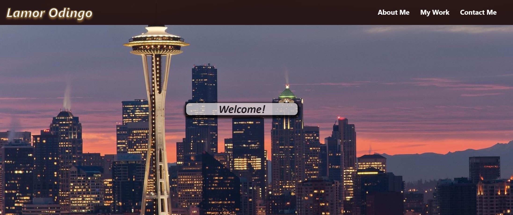
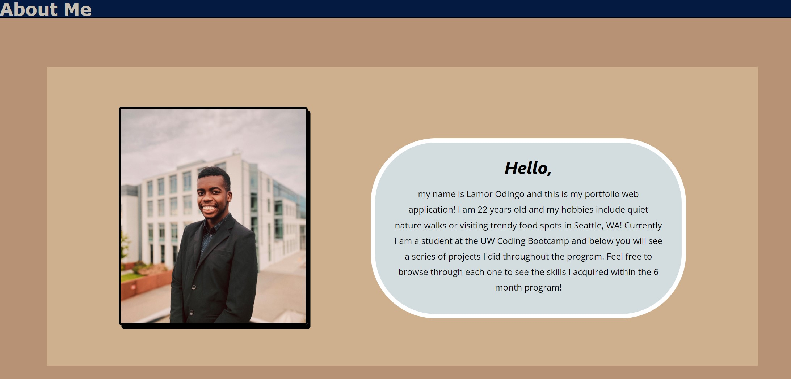
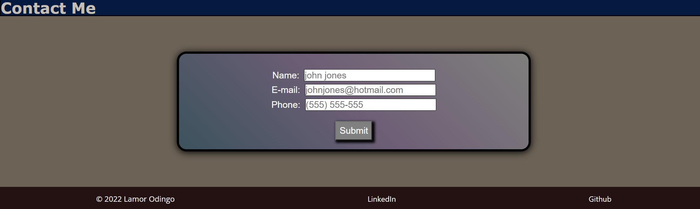

# 02 Advanced CSS: Portfolio

## My Task

<br>This week I was tasked in creating my first portfolio web application to showcase the progress I have made in the UW Coding Bootcamp Course.
The page needed to highlight the types of skills I would cultivate from completed projects throughout the course in order for me to be considered job-ready.

## User Story

<br>AS AN exceptional web developer

I WANT an accessible deployed web portfolio of work projects

SO THAT employers can review my skills and consider having me as a candidate for their company

<br>

## Employer User Story
<br>

```
AS AN employer
I WANT to view a potential employee's deployed portfolio of work samples
SO THAT I can review samples of their work and assess whether they're a good candidate for an open position
```
<br>

## Application

<br>The following animation shows the web applications's appearance and functionality:<br><br>


<br>

## What I Accomplished 

<br>



***Header & Background Image***

When first loading the page there is a header style with my first and last name in the left corner and the nav bar which links to the existing sections on the page. Once a user clicks one of links in the navigation bar the UI automatically takes the user to the corresponding section.

Following the header lies the background-image which introduces the user to the city of Seattle! The photo also provides a great segue to my "About Me" section <br><br>



***About Me Section***

When the user scrolls down or uses the nav link they are introduced to this section, my "About Me"! Above this is my section header titled "About Me". I have listed 2 other section headers corresponding to the title of the nav links above. In this specific section the user gets to see my professional business photo taken in the city of Seattle and to the right of the photo exists a small section giving a somewhat formal introduction to the web page and a brief share of my hobbies.<br><br>


***My Work***

The "My Work" section stores the main part of my web page, my projects. Each card showcases the project I have completed over time and any user can see that Project #1 is larger in size than the others. When a user hovers and clicks on the image of the project the user jumps to another window where it directs them to that deployed application.<br><br>



**Contact Me & Footer**

Last but no least is the "Contact Me" & Footer section. For now, the contact me section provides any user access to type in theier Name, E-mail, and Phone number for reaching out to me. There is no JavaScript quite yet so nothing will truly get submitted anywhere. Below is the footer section where I attached links to my LinkedIn and GitHub account.<br>

<ul>
<br> <li>Lastly, I devoted the rest of my time to formatting my web application where a user can view the site on various screens and devces.</li>
</ul>
<br>

## External Links
[Deployed Application](https://odingol.github.io/02-hw-css-portfolio/)

[GitHub Repository](https://github.com/odingol/02-hw-css-portfolio.git)
